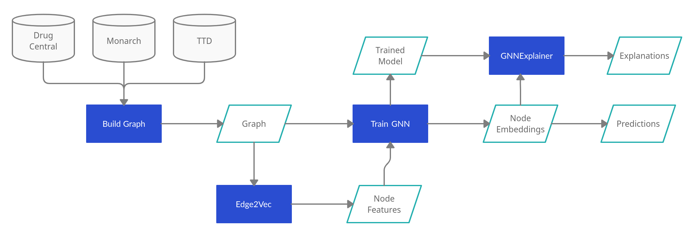

# Duchenne Muscular Dystrophy Drug Reourposing using Knowledge Graphs and eXplainable AI

In this repository you will find the code necessary to run the pipeline shown in: [ThesisFinal.pdf](ThesisFinal.pdf). This pipeline is part of a Master Thesis project and it is expected to be improved throughout time. 

The objective of this project is that, given a number of seeds related to a target (rare) disease, several drug candidates and **explanations** will be obtained for the symptoms of the targeted disease.

The environment used to run this project can be created using  [requirements.txt](requirements.txt) the In total, three Jupyter Notebooks are used to obtain the predictions and the explanations. The first one, [Notebook_1.ipynb](DMD_KG/Notebook_1.ipynb), is used to create a Knowledge Graph containing information of the disease. In this first notebook, only information from [Monarch](https://monarchinitiative.org/), is used. To incorporate drug information (Drug-Target and Drug-Disease) the second notebook, [Notebook_2.ipynb](Notebook_2.ipynb), is used. This notebook incorporates information from [DrugCentral](https://drugcentral.org/) and [Therapeutic Terget Database](http://db.idrblab.net/ttd/). The final notebook, [Notebook_3.ipynb](Notebook_3.ipynb), is the one that provides the predictions and the explanations. Each notebook contains information about its use, but in the next sections there is a small summary showing its details.

## List of files

The description of the files and folders used in this project is the following: 

* [requirements.txt](requirements.txt): list of requirements necessary to load the work environment used in the project
* [DMD_KG](DMD_KG): Folder containing the files to necessary to create the Knowledge Graphs 
* [monarch.py](DMD_KG/monarch.py): Python file containing the necessary modules to run Bioknowledge Reviewer
* [Notebook_1.ipynb](DMD_KG/Notebook_1.ipynb): Jupyter Notebook that is used to build the Knowledge Graph
* [Notebook_2.ipynb](Notebook_2.ipynb): Jupyter Notebook used to include drug information to the Knowledge Graph
* [Notebook_3.ipynb](Notebook_3.ipynb): Jupyter Notebook used to obtain the predictions and the explanations
* [edge2vec3.py](edge2vec3.py) & [transition3.py](transition3.py): Python files containing the modules to run Edge2Vec
* [graph_nodes_v2022-01-11.csv](graph_nodes_v2022-01-11.csv): CSV file containing the nodes of the Knowledge Graph created using two seeds: Duchenne Muscular Dystrophy (MONDO:0010679) and *DMD* (HGNC:2928)
* [graph_edges_v2022-01-11.csv](graph_edges_v2022-01-11.csv): CSV file containing the edges of the Knowledge Graph created using two seeds: Duchenne Muscular Dystrophy (MONDO:0010679) and *DMD* (HGNC:2928)
* [drug.target.interaction.tsv](drug.target.interaction.tsv): TSV file downloaded from DrugCentral, contains Drug-Target information
* [drug_to_disease.txt](drug_to_disease.txt): TXT file downloaded from TTD, contains Drug-Disease information
* [matched.csv](matched.csv): CSV file containing the TTD diseases matched to the Human Phenotype Ontology (HPO), this was done using SORTA.
* [drug_nodes.csv](drug_nodes.csv): CSV file containing the drug nodes of the Knowledge Graph
* [drug.target.final (1).csv](drug.target.final%20(1).csv): CSV file containing Drug-Target edges of the Knowledge Graph
* [drug_to_disease_final (1).csv](drug_to_disease_final%20(1).csv): CSV file containing Drug-Disease edges of the Knowledge Graph

## Graph building (Monarch)

In this first part, the Knowledge Graph is created using information from Monarch, this is done in [Notebook_1.ipynb](DMD_KG/Notebook_1.ipynb). To extract information from Monarch, Bioknowledge Reviewer is used. As input you will need a number of seeds of the targeted diseases. The seeds are the IDs used by Monarch to identify its elements. You can use the [Monarch](https://monarchinitiative.org/) interface to search for the seeds. In our example, we have used seeds of Duchenne Muscular Dystrophy (MONDO:0010679) and the gene affected innthe disease: *DMD* (HGNC:2928). As output, two *.csv* files are obtained, one containing the nodes of the Knowledge Graph and one containing the edges of the Knowledge Graph. 

## Graph building (DrugCentral and TTD)

The second part is to incorporate drug information from DrugCentral and TTD, this is done using [Notebook_2.ipynb](Notebook_2.ipynb). As input, this notebook receives the two *csv* files generated in the previous step, a *csv* file containing information from [DrugCentral](https://unmtid-shinyapps.net/download/DrugCentral/2021_09_01/drug.target.interaction.tsv.gz), a *txt* file containing information from [Therapeutic Terget Database](http://db.idrblab.net/ttd/sites/default/files/ttd_database/P1-05-Drug_disease.txt) and a file matching TTD IDs to Monarch IDs (this file corresponds to [drug_to_disease_final (1).csv](drug_to_disease_final%20(1).csv), and was obtained using [SORTA](https://sorta.molgeniscloud.org/menu/main/sorta?). As output this notebook produces two *csv* files, one containing all the nodes of the Knowledge Graph and one containing all the edges of the Knowledge Graph.

## Predictions and Explanations

In this final part predictions and explanations are obtained, this is done using [Notebook_3.ipynb](Notebook_3.ipynb). To obtain predictions a Graph Neural Network (GNN) model was build. This model was created using *Pytorch Geometric* and *DeepSnap*. To obtain the explanations a modified version of GNNExplainer is used. This modified version is allows for explanations on a link prediction task. As input, this notebook receives the two *csv* files obtained in the previous step, and as output in provides a list of drug candidates for each symptom of the disease and a list of explanations supporting these predictions. 
